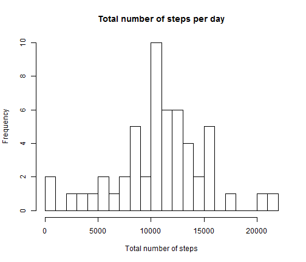
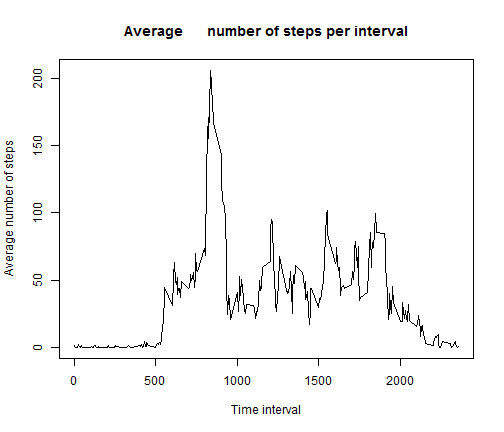
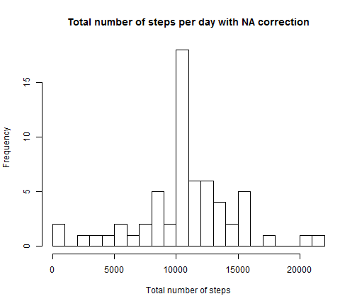
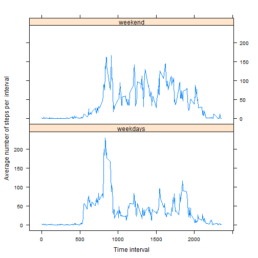

Peer Assessment 1
========================================================

## Loading and preprocessing the data


```r
library(dplyr)
```

```
## 
## Attaching package: 'dplyr'
## 
## The following object is masked from 'package:stats':
## 
##     filter
## 
## The following objects are masked from 'package:base':
## 
##     intersect, setdiff, setequal, union
```

```r
library(lattice)
options(scipen=10)
data <- read.csv(paste0(getwd(),"/activity.csv"))
by_day <- group_by(data, date)
total_steps <- summarize(by_day, total = sum(steps))
total_steps$date <- as.Date(total_steps$date, "%Y-%m-%d")
```

## What is mean total number of steps taken per day?


```r
hist(total_steps$total, breaks=20,xlab="Total number of steps", main="Total number of steps per day")
```

 


```r
meansteps <- mean(total_steps$total, na.rm=T)
mediansteps <- median(total_steps$total, na.rm=T)
```

On average, a total number of 10766.19 has been recorded. The median of the total number of steps equals 10765 .

## What is the average daily activity pattern?


```r
by_5min <- group_by(data, interval)
mean_steps <- summarise(by_5min, mean=mean(steps,na.rm=T))

plot(mean_steps$interval, mean_steps$mean, type="l", main="Average      number of steps per interval", xlab="Time interval", ylab="Average number of steps")
```

 

```r
max_interval <- mean_steps[which.max(mean_steps$mean),]
```

The maximum average number of steps, 206.17, occures at the 835-interval in the data.


## Imputing missing values


```r
colSums(is.na(data))
```

```
##    steps     date interval 
##     2304        0        0
```

A simple way of imputing missing values is to use the average number of steps of the corresponding interval.


```r
data.na.rm <- data
for(i in 1:dim(data)[1]) {
if(is.na(data[i,1])) {data.na.rm[i,1] <- mean_steps[which(mean_steps$interval==data[i,3]),2]}
}
```


```r
by_dayr <- group_by(data.na.rm, date)
total_stepsr <- summarize(by_dayr, total = sum(steps, na.rm=T))
hist(total_stepsr$total, breaks=20,xlab="Total number of steps", main="Total number of steps per day with NA correction")
```

 


```r
options(scipen=3)
meanstepsr <- mean(total_stepsr$total)
medianstepsr <- median(total_stepsr$total)
```

With correction for the missing values, the mean is 10766.19 and the median equals 10766.19.  
Hence, imputing missing values does not change the mean but the median increases about 1.19 and is now equal to the mean. 


## Are there differences in activity patterns between weekdays and weekends?


```r
weekd <- mutate(data.na.rm, weekend = factor(weekdays(as.Date(date,"%Y-%m-%d"))=="Samstag" | weekdays(as.Date(date,"%Y-%m-%d"))=="Sonntag", labels=c("weekdays","weekend")))

by_5min_weekd <- group_by(weekd, interval, weekend)
mean_steps_weekd <- summarise(by_5min_weekd, mean=mean(steps,na.rm=T))


xyplot(mean ~ interval|weekend, mean_steps_weekd, type="l", layout=c(1,2), xlab="Time interval", ylab="Average number of steps per  interval")
```

 


